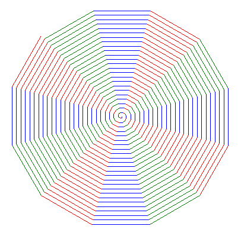
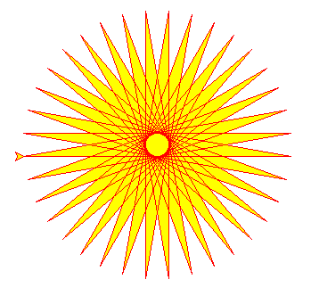
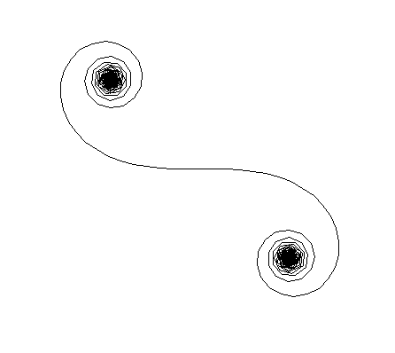
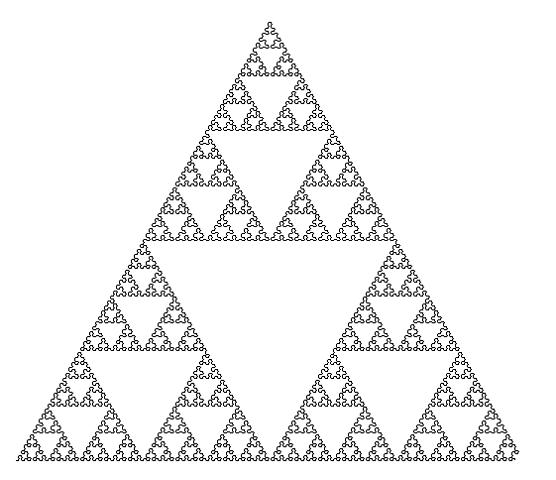

# python_turtle_graphics
Demonstration of the turtle graphics using python

|              |          |
| ------------------------------------------ | -------------------------------------- |
|              |          |
|  |  |

